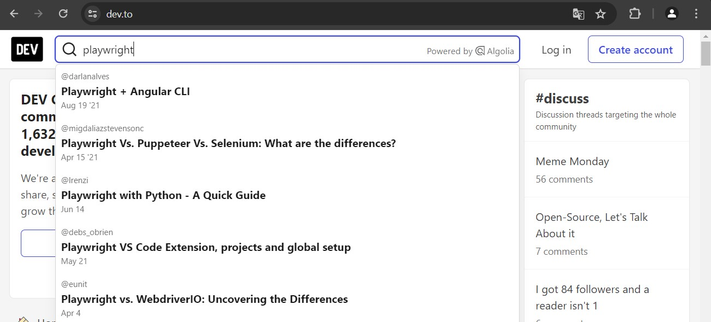

## ABOUT THIS DEMO 
This is a web scraping demo with Playwright where we practice interaction with the page and data extraction.

In this case, we interact by searching for the term 'playwright' in the site's search bar, entering each mentioned article, and extracting and saving its title.

## RESULT OF SCRAPING A WEB PAGE
We search for a term

\
All articles containing that term are displayed.

\
We enter each one of them and extract and save the title.

\
Result

## AUTHORS ✒️
*[@Cristina16z](https://github.com/cristina16z)*

